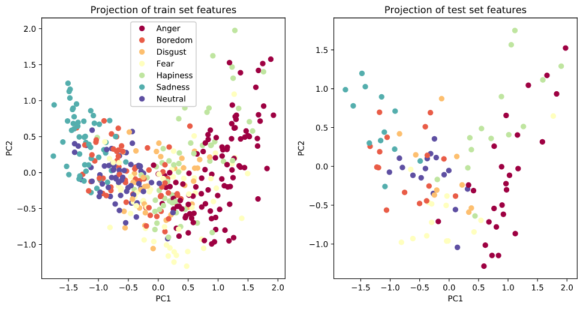

# Speech Emotion Recognition on Emo-DB
**Frédéric Debraine**, 30/05/2020

# Revisions (13/06/2020):
- Train/test split based on speaker id to avoid data leakage or overfitting on voices.
- Replace stratified CV by Group CV to avoid data leakage between train and validation sets.
- Replace ROC-AUC metric by F1 (otherwise we need probability outputs for all models, not possible for ensemble)
- Making sure the score average mode is on 'weighted' to take into account class imbalance.

### Project structure
* modules: Python scripts related to ML pipeline.
* data: Contains Emo-DB dataset.
* app.py: Flask API defining end points to train and predict.
* Dockerfile: Defines steps to build container (install dependencies, download and extract data, expose ports,...)
* docker-compose.yml: Automatize the build and run of two containers: one for the jupyter notebook and the other for the Flask API.
* Report_SER.ipynb: Notebook used for fast prototyping and presenting preliminary results and visualizations.

### Running Docker containers
* `docker-compose build`
* `docker-compose up`

### Access Jupyter Notebook
* Open in browser: http://localhost:8081/tree?
* Password: password

### Training the model
* `curl http://0.0.0.0:8080/train`
* You can also select the number of top base models to consider from 2 to 5 (default is n=3): `curl http://0.0.0.0:8080/train?n=3`

### Getting available test ids (unseen by the model during training)
* `curl http://0.0.0.0:8080/test_ids | json_pp`

### Predicting
* `curl http://0.0.0.0:8080/predict?id=10b09Lb`

### Credits
* https://github.com/ritikraj660/Speech-emotion-recognition/
* https://librosa.github.io/librosa/index.html
* https://www.datasciencelearner.com/
* https://towardsdatascience.com/
